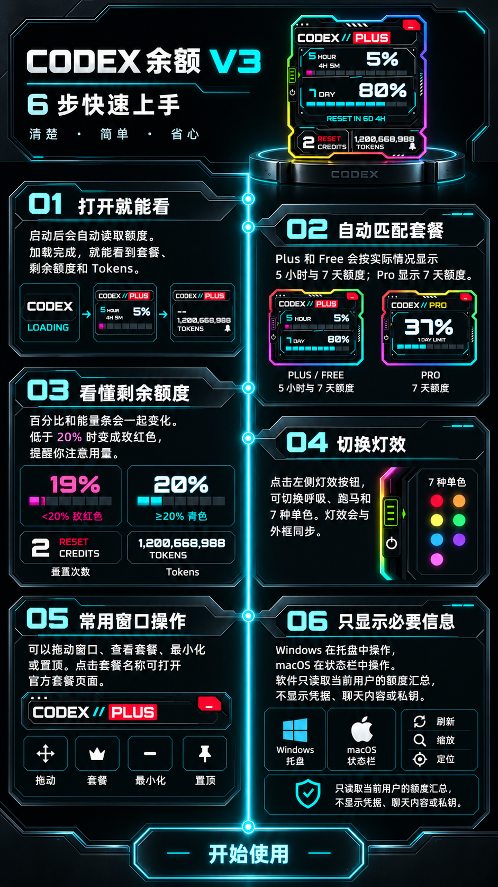

# Codex 余额 V3

## 直接下载

- [下载 Windows x64 V3](https://github.com/littlecao123/codex-quota-v3/releases/download/v3.0.0-beta.1/CodexQuota-V3-Windows-x64-Standard-3.0.0-beta.1.zip)
- [下载 macOS Universal V3（Intel 与 Apple Silicon，未签名）](https://github.com/littlecao123/codex-quota-v3/releases/download/v3.0.0-beta.1/CodexQuota-V3-macOS-Universal-Intel-Apple-Silicon-3.0.0-beta.1-unsigned.zip)
- [查看完整 Release 与 SHA-256](https://github.com/littlecao123/codex-quota-v3/releases/tag/v3.0.0-beta.1)

一个简洁的桌面额度小组件，自动显示当前套餐、5 小时/7 天剩余额度、重置时间、Reset Credits 和 Tokens。

它支持 Windows 与 macOS，并提供呼吸、跑马和单色灯效。窗口可以拖动、最小化、置顶，也可以从套餐名称打开官方套餐页面。

## 快速上手说明书

## 使用方法

- Windows：下载 ZIP，解压后运行 `CodexData.exe`。
- macOS：下载 Universal ZIP，解压后运行应用；同时支持 Intel 与 Apple Silicon。

macOS 当前包尚未进行 Developer ID 签名和 Apple 公证，因此首次打开时可能出现系统安全提示。文件名已明确保留 `unsigned`，不会冒充已签名正式包。

## 隐私

软件只读取当前用户的额度汇总，不显示或上传账号凭据、聊天内容、会话正文或私钥。这个公开仓库只提供下载说明、图片和安装包，不公开应用源代码。
